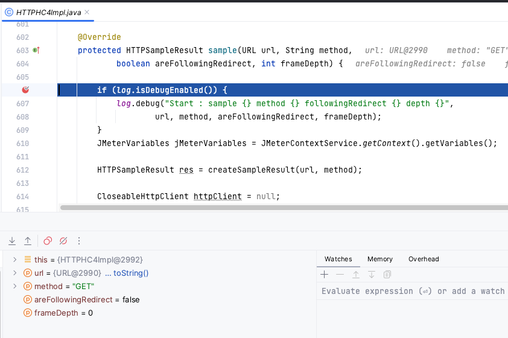
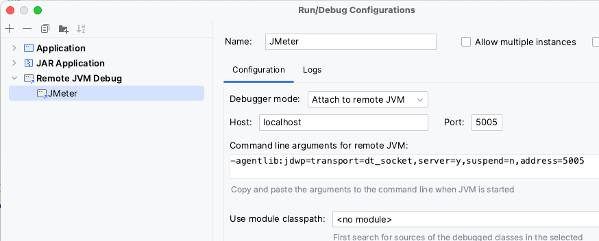

### Debug JMeter code

You can even add breakpoints to JMeter or JMeter Java DSL code in your IDE and debug the code line by line providing the greatest possible detail.

Here is an example screenshot debugging HTTP Sampler:



For that, you need to:

* have a Java IDE with JMeter or JMeter Java DSL code open. 
* set proper breakpoints in the code you are interested in debugging.
* can configure Remote JVM Debug like in the following screenshot:
  
* set required JVM arguments in the JMeter .Net DSL test using `EmbeddedJmeterEngine` like in the following example:
  ```cs
  TestPlan(
        ThreadGroup(threads: 1, iterations: 1,
            HttpSampler("http://my.service")
        )
    ).RunIn(new EmbeddedJmeterEngine()
            .JvmArgs("-agentlib:jdwp=transport=dt_socket,server=y,suspend=y,address=5005"));
  ```
  > Note that we changed the `suspend` flag to `y` to block test execution until Remote JVM Debug is run in IDE.
* run the JMeter .Net DSL test. The test should get stuck until you start Remote JVM Debug in the Java IDE.
* start the Remote JVM Devug in the Java IDE.
* wait for a breakpoint to activate and debug as usual 🙂.

::: tip
JMeter class in charge of executing threads logic is `org.apache.jmeter.threads.JMeterThread`. You can check the classes used by each DSL-provided test element by checking the Java DSL code.
:::
