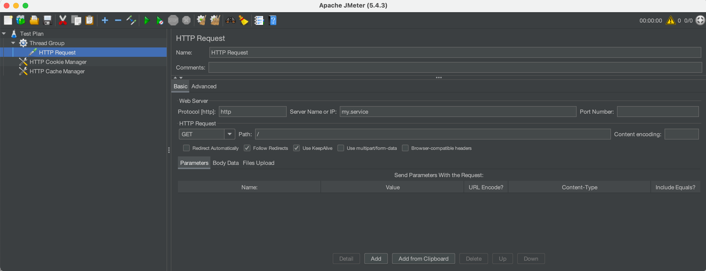

### Test plan review un JMeter GUI

A usual requirement for new DSL users that are used to Jmeter GUI, is to be able to review Jmeter DSL generated test plan in the familiar JMeter GUI. For this, you can use the `ShowInGui()` method in a test plan to open JMeter GUI with the preloaded test plan.

This can be also used to debug the test plan, by adding elements (like view results tree, dummy samplers, etc.) in the GUI and running the test plan.

Here is a simple example using the method:

```cs
using static Abstracta.JmeterDsl.JmeterDsl;

public class PerformanceTest
{
    [Test]
    public void LoadTest()
    {
        var stats = TestPlan(
            ThreadGroup(2, 10,
                HttpSampler("http://my.service")
            )
        ).ShowInGui();
    }
}
```

Which ends up opening a window like this one:

