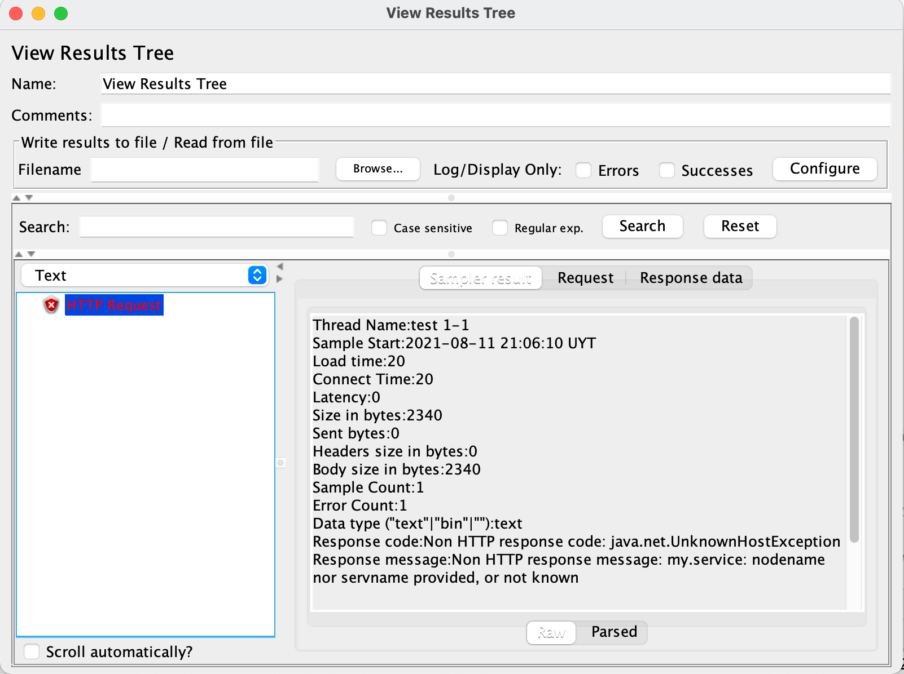

### View results tree

One option is using provided `ResultsTreeVisualizer()` like in the following example:

```cs
using static Abstracta.JmeterDsl.JmeterDsl;

public class PerformanceTest
{
    [Test]
    public void LoadTest()
    {
        var stats = TestPlan(
            ThreadGroup(2, 10,
                HttpSampler("http://my.service")
            ),
            ResultsTreeVisualizer()
        ).Run();
    }
}
```

This will display the JMeter built-in View Results Tree element, which allows you to review request and response contents in addition to collected metrics (spent time, sent & received bytes, etc.) for each request sent to the server, in a window like this one:



::: tip
To debug test plans use a few iterations and threads to reduce the execution time and ease tracing by having less information to analyze.
:::

::: tip
When adding `ResultsTreeVisualizer()` as a child of a thread group, it will only display sample results of that thread group. When added as a child of a sampler, it will only show sample results for that sampler. You can use this to only review certain sample results in your test plan.
:::

::: tip
**Remove `ResultsTreeVisualizer()` from test plans when are no longer needed** (when debugging is finished). Leaving them might interfere with unattended test plan execution (eg: in CI) due to test plan execution not finishing until all visualizers windows are closed.
:::

::: warning
By default, View Results Tree only displays the last 500 sample results. If you need to display more elements, use provided `ResultsLimit(int)` method which allows changing this value. Take into consideration that the more results are shown, the more memory that will require. So use this setting with care.
:::