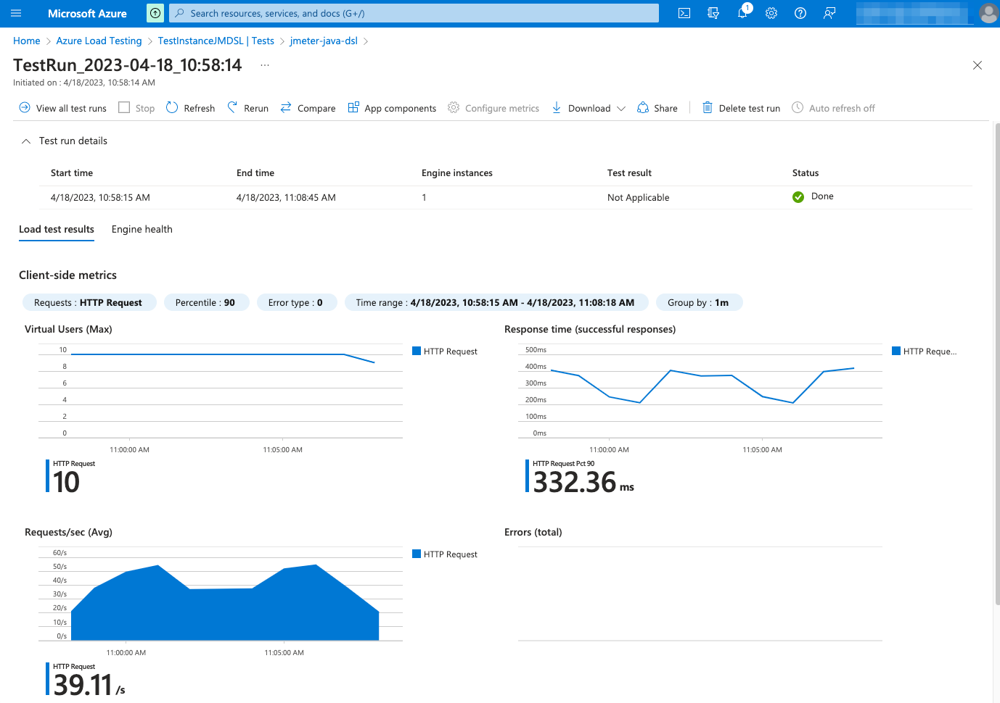

### Azure Load Testing

To use [Azure Load Testing](https://azure.microsoft.com/en-us/products/load-testing/) to execute your test plans at scale is as easy as including the following package to your project:

```powershell
dotnet add package Abstracta.JmeterDsl.Azure --version 0.1
```

And using the provided engine like this:

```cs
using Abstracta.JmeterDsl.Azure;
using static Abstracta.JmeterDsl.JmeterDsl;

public class PerformanceTest
{
    [Test]
    public void LoadTest()
    {
        var stats = TestPlan(
            ThreadGroup(2, 10,
                HttpSampler("http://my.service")
            )
        ).RunIn(new AzureEngine(System.getenv("AZURE_CREDS")) // AZURE_CREDS=tenantId:clientId:secretId
            .TestName("dsl-test")
            /* 
            This specifies the number of engine instances used to execute the test plan. 
            In this case, means that it will run 2(threads in thread group)x2(engines)=4 concurrent users/threads in total. 
            Each engine executes the test plan independently.
            */
            .Engines(2) 
            .TestTimeout(Duration.ofMinutes(20)));
        Assert.That(stats.Overall.SampleTimePercentile99, Is.LessThan(TimeSpan.FromSeconds(5)));
    }
}
```
> This test is using `AZURE_CREDS`, a custom environment variable containing `tenantId:clientId:clientSecret` with proper values for each. Check at [Azure Portal tenant properties](https://portal.azure.com/#view/Microsoft_AAD_IAM/TenantPropertiesBlade) the proper tenant ID for your subscription, and follow [this guide](https://learn.microsoft.com/en-us/azure/active-directory/develop/howto-create-service-principal-portal) to register an application with proper permissions and secrets generation for tests execution.

With Azure, you can not only run the test at scale but also get additional features like nice real-time reporting, historic data tracking, etc. Here is an example of how a test looks like in Azure Load Testing:



Check [AzureEngine](/Abstracta.JmeterDsl.Azure/AzureEngine.cs) for details on usage and available settings when running tests in Azure Load Testing.

::: warning
By default, the engine is configured to time out if test execution takes more than 1 hour.
This timeout exists to avoid any potential problem with Azure Load Testing execution not detected by the
client, and avoid keeping the test indefinitely running until is interrupted by a user,
which may incur unnecessary expenses in Azure and is especially annoying when running tests 
in an automated fashion, for example in CI/CD.
It is strongly advised to **set this timeout properly in each run**, according to the expected test
execution time plus some additional margin (to consider for additional delays in Azure Load Testing
test setup and teardown) to avoid unexpected test plan execution failure (due to timeout) or
unnecessary waits when there is some unexpected issue with Azure Load Testing execution.
:::

::: tip
If you want to get debug logs for HTTP calls to Azure API, you can include the following setting to an existing `log4j2.xml` configuration file:
```xml
<Logger name="us.abstracta.jmeter.javadsl.azure.AzureClient" level="DEBUG"/>
<Logger name="okhttp3" level="DEBUG"/>
```
:::
