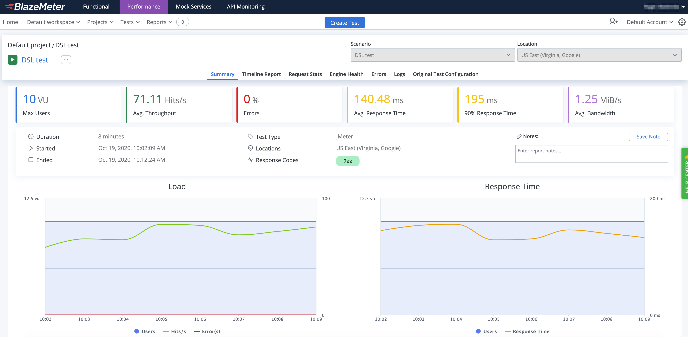

### BlazeMeter

By including the following package:

```powershell
dotnet add package Abstracta.JmeterDsl.BlazeMeter --version 0.2
```

You can easily run a JMeter test plan at scale in [BlazeMeter](https://www.blazemeter.com/) like this:

```cs
using Abstracta.JmeterDsl.BlazeMeter;
using static Abstracta.JmeterDsl.JmeterDsl;

public class PerformanceTest
{
    [Test]
    public void LoadTest()
    {
        var stats = TestPlan(
            // number of threads and iterations are in the end overwritten by BlazeMeter engine settings 
            ThreadGroup(2, 10,
                HttpSampler("http://my.service")
            )
        ).RunIn(new BlazeMeterEngine(Environment.GetEnvironmentVariable("BZ_TOKEN"))
            .TestName("DSL test")
            .TotalUsers(500)
            .HoldFor(TimeSpan.FromMinutes(10))
            .ThreadsPerEngine(100)
            .TestTimeout(TimeSpan.FromMinutes(20))
            .TestName("dsl-test"));
        Assert.That(stats.Overall.SampleTimePercentile99, Is.LessThan(TimeSpan.FromSeconds(5)));
    }
}
```

> This test is using `BZ_TOKEN`, a custom environment variable with `<KEY_ID>:<KEY_SECRET>` format, to get the BlazeMeter API authentication credentials.

Note that is as simple as [generating a BlazeMeter authentication token](https://guide.blazemeter.com/hc/en-us/articles/115002213289-BlazeMeter-API-keys-) and adding `.RunIn(new BlazeMeterEngine(...))` to any existing JMeter DSL test to get it running at scale in BlazeMeter.

BlazeMeter will not only allow you to run the test at scale but also provides additional features like nice real-time reporting, historic data tracking, etc. Here is an example of how a test would look in BlazeMeter:



Check [BlazeMeterEngine](/Abstracta.JmeterDsl.BlazeMeter/BlazeMeterEngine.cs) for details on usage and available settings when running tests in BlazeMeter.

::: warning
By default the engine is configured to timeout if test execution takes more than 1 hour.
This timeout exists to avoid any potential problem with BlazeMeter execution not detected by the
client, and avoid keeping the test indefinitely running until is interrupted by a user,
which may incur in unnecessary expenses in BlazeMeter and is specially annoying when running tests
in automated fashion, for example in CI/CD.
It is strongly advised to **set this timeout properly in each run**, according to the expected test
execution time plus some additional margin (to consider for additional delays in BlazeMeter
test setup and teardown) to avoid unexpected test plan execution failure (due to timeout) or
unnecessary waits when there is some unexpected issue with BlazeMeter execution.
:::

::: warning
`BlazeMeterEngine` always returns 0 as `sentBytes` statistics since there is no efficient way to get it from BlazMeter.
:::

::: tip
In case you want to get debug logs for HTTP calls to BlazeMeter API, you can include the following setting to an existing `log4j2.xml` configuration file:
```xml
<Logger name="us.abstracta.jmeter.javadsl.blazemeter.BlazeMeterClient" level="DEBUG"/>
<Logger name="okhttp3" level="DEBUG"/>
```
:::
