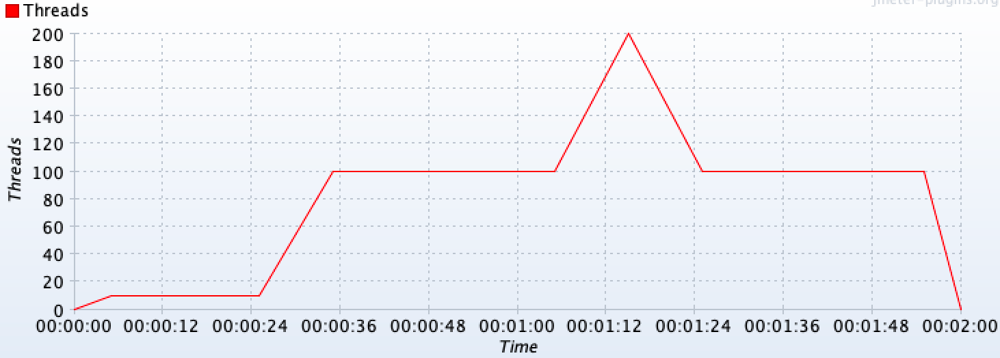
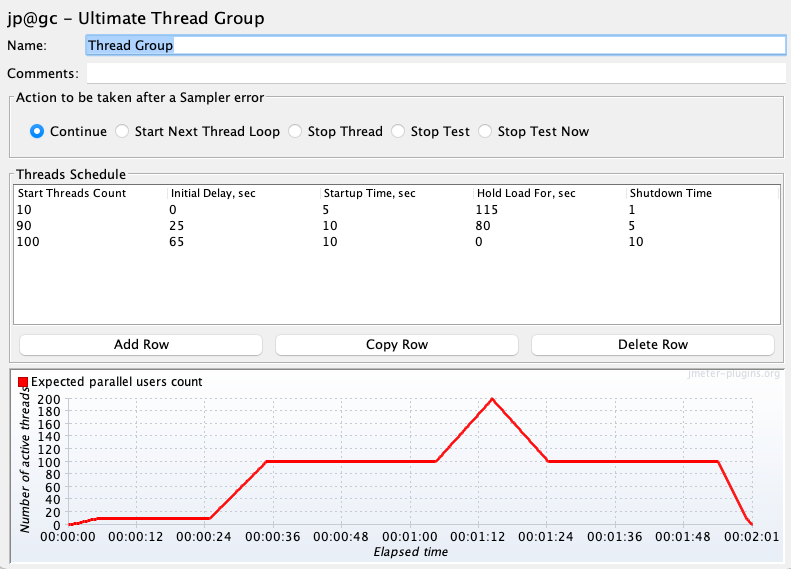

### Thread ramps and holds

When working with many threads, it is advisable to configure a ramp-up period, to avoid starting all threads at once affecting performance metrics and generation.

You can easily configure a ramp-up with the DSL like this:

```cs
ThreadGroup().RampTo(10, TimeSpan.FromSeconds(5)).HoldIterating(20) // ramp to 10 threads for 5 seconds (1 thread every half second) and iterating each thread 20 times
ThreadGroup().RampToAndHold(10, TimeSpan.FromSeconds(5), TimeSpan.FromSeconds(20)) //similar as above but after ramping up holding execution for 20 seconds
```

Additionally, you can use and combine these same methods to configure more complex scenarios (incremental, peak, and any other types of tests) like the following one:

```cs
ThreadGroup()
    .RampToAndHold(10, TimeSpan.FromSeconds(5), TimeSpan.FromSeconds(20))
    .RampToAndHold(100, TimeSpan.FromSeconds(10), TimeSpan.FromSeconds(30))
    .RampTo(200, TimeSpan.FromSeconds(10))
    .RampToAndHold(100, TimeSpan.FromSeconds(10), TimeSpan.FromSeconds(30))
    .RampTo(0, TimeSpan.FromSeconds(5))
    .Children(
      HttpSampler("http://my.service")
    )
```

Which would translate into the following threads' timeline:



Check [DslThreadGroup](/jmeter-java-dsl/src/main/java/us/abstracta/jmeter/javadsl/core/threadgroups/DslThreadGroup.java) for more details.

::: tip
If you are a JMeter GUI user, you may even be interested in using provided `TestElement.ShowInGui()` method, which shows the JMeter test element GUI that could help you understand what will DSL execute in JMeter. You can use this method with any test element generated by the DSL (not just thread groups).

For example, for the above test plan you would get a window like the following one:


:::

::: tip
When using multiple thread groups in a test plan, consider setting a name (eg: `ThreadGroup("main", 1, 1, ...)`) on them to properly identify associated requests in statistics & jtl results.
:::
